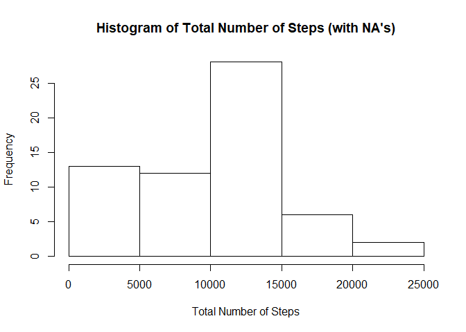
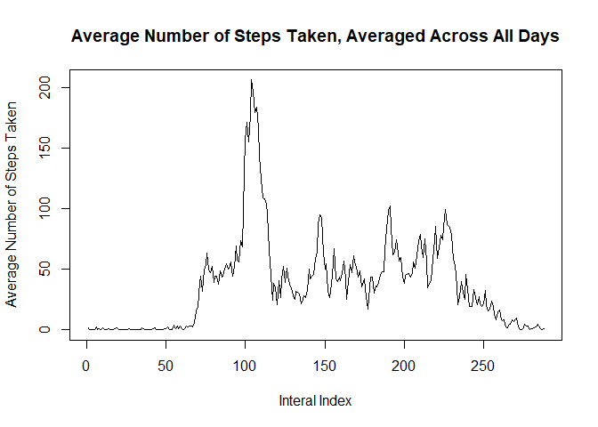
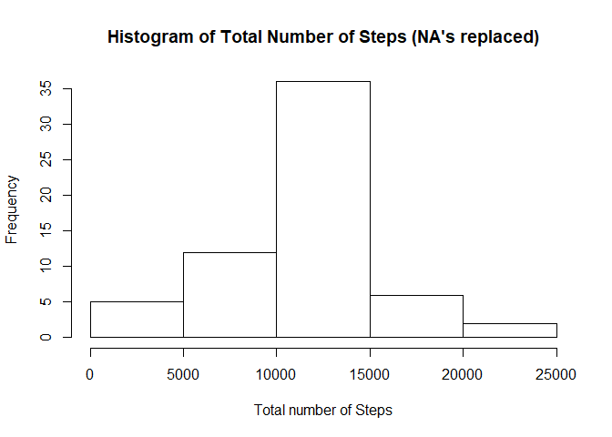
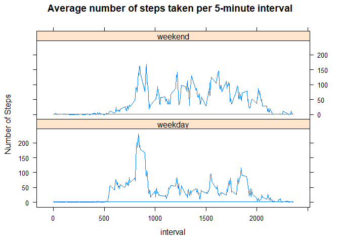

## Loading and preprocessing the data


```r
act <- read.csv("activity/activity.csv", stringsAsFactors = FALSE)
act$date <- as.Date(act$date, "%Y-%m-%d")  #convert to date
```


## What is mean total number of steps taken per day?


```r
library(ggplot2)
totalsteps <- tapply(act$steps, act$date, sum, na.rm = TRUE)
hist(totalsteps, 
     main = "Histogram of Total Number of Steps (with NA's)", 
     xlab = "Total Number of Steps")
```

<!-- -->

```r
totalmean <- mean(totalsteps)
totalmedian <- median(totalsteps)
```

The mean total number of steps taken per day is 9354.2295082 and the median total number of steps taken per day is 10395.

## What is the average daily activity pattern?


```r
# Average number of steps for each corresponding 5 min interval
avg5min <- tapply(act$steps, act$interval, mean, na.rm = TRUE)  #average number of steps for each corresponding 5 min interval

plot(avg5min, 
     type = "l", 
     main = "Average Number of Steps Taken, Averaged Across All Days", 
     xlab = "Interal Index", 
     ylab = "Average Number of Steps Taken")
```

<!-- -->

```r
# Index value for the interval with highest average number of steps.
max5min <- names(avg5min[which(avg5min == max(avg5min))])
```

The maximum number of steps, on average across all days, occured in the 835 interval.

## Imputing missing values


```r
indexmissing <- is.na(act$steps)
missing <- sum(indexmissing)

newact <-act  #copy original data to new data frame

# Average number of steps over each interval
intervalmeans <- tapply(newact$steps, newact$interval, mean, na.rm = TRUE)  

# Replace NA's with the corresponding interval mean
newact[indexmissing,]$steps <- 
        intervalmeans[as.character(newact[indexmissing,]$interval)]  

# Total number of steps for each date
totalsteps2 <- tapply(newact$steps, newact$date, sum, na.rm = TRUE)  

hist(totalsteps2, 
     main = "Histogram of Total Number of Steps (NA's replaced)", 
     xlab = "Total number of Steps")
```

<!-- -->

```r
totalmean2 <- mean(totalsteps2)
totalmedian2 <- median(totalsteps2)
```

There are 2304 missing values (coded as NA) in the variable steps in the original data.  
For each missing value, it was replaced with the average number of steps of the corrresponding 5-minute interval.  
After the replacements, the new mean total number of steps taken per day is 1.0766189\times 10^{4} and the median total number of steps taken per day is 1.0766189\times 10^{4}. Both the mean and median increased after replacing the NA's.


## Are there differences in activity patterns between weekdays and weekends?


```r
library(dplyr)
library(lattice)
library(ggplot2)

newact2 <- mutate(newact, days = weekdays(date))  #create new variable days

# Loop through all rows and classify the day of the week as 'weekday' or 'weekend'
for (i in 1:length(newact2$days)){
        if (newact2[i,]$days == "Saturday"|| newact2[i,]$days == "Sunday"){
                newact2[i,]$days = "weekend"
        } else {
                newact2[i,]$days = "weekday"
        }
}

newact2$days <- factor(newact2$days, 
                       levels = c("weekday","weekend"), 
                       labels = c("weekday", "weekend"))

# Create a new data frame for the purpose of panel plot, with the average number
# of steps per interval per factor 'days' in the new column
wknd <- filter(newact2, days == "weekend")
wkday <- filter(newact2, days == "weekday")
wknd$temp <- tapply(wknd$steps, wknd$interval, mean)
wkday$temp <- tapply(wkday$steps, wkday$interval, mean)
newact3 <- rbind(wknd, wkday)

xyplot(temp ~ interval | days, 
       data = newact3, layout = c(1,2), 
       type = "l", 
       ylab = "Number of Steps", 
       main = "Average number of steps taken per 5-minute interval")
```

<!-- -->


